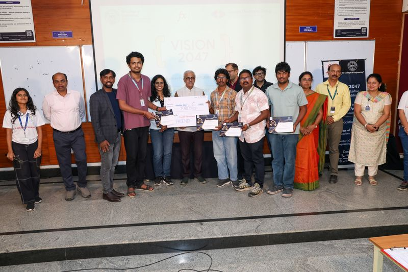
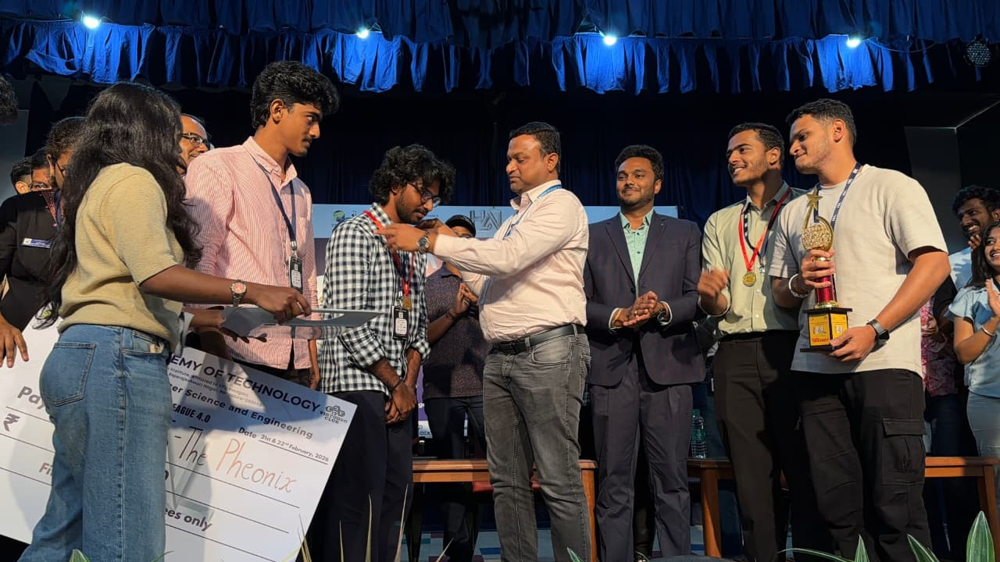
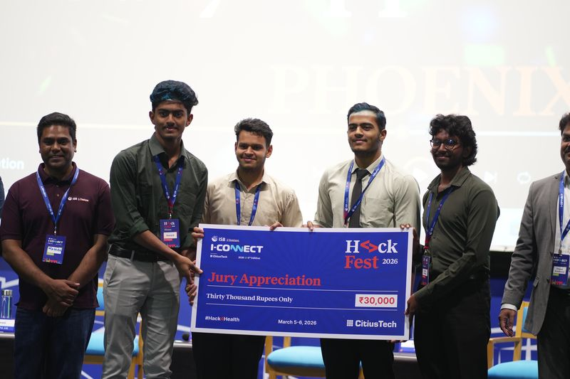
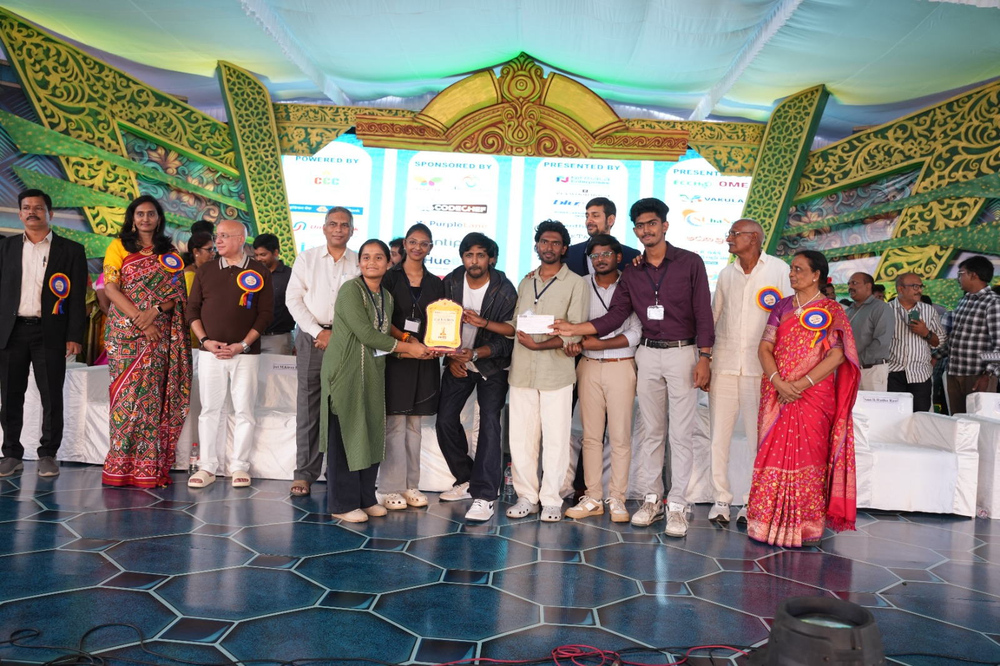
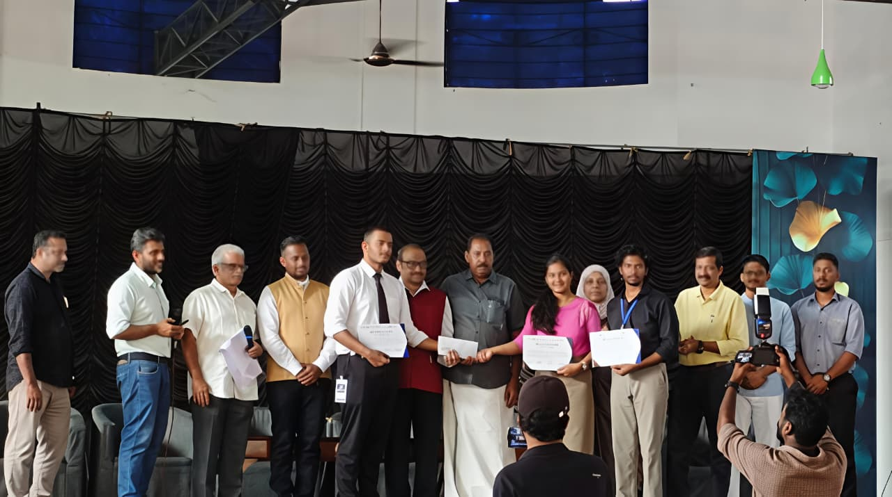
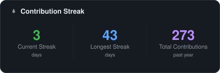
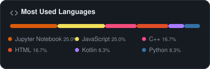
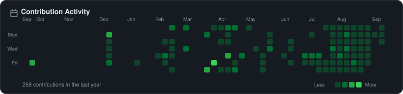

Computer Science Undergraduate

## About

Building things to understand how they work.

Interested in backend engineering, AI, data analysis, distributed systems, open source, and developer tools.

Hackathons taught me how to ship under pressure. The gallery below has some of those stories.

## Tech Stack

 

**Languages**
 

  

**Mobile & Frontend**
 

  

**Backend & Data**
 

  

**AI / ML**
 

 
<code>LangChain</code> &nbsp; <code>FAISS</code> &nbsp; <code>RAG</code> &nbsp; <code>HuggingFace</code>

  

**Tools & Platforms**
 

## Projects

<table>
<tr>
<td width="33%" valign="top">

### BhaiHisaab

Trip-expense tracker for Android. Splits bills, tracks who owes what, reflects money leaving your account the moment you lend it.

Simple mode (shared pool) and Complex mode (individual accounts). Fully offline.

`Kotlin` `Jetpack Compose` `Room` `Material 3`

</td>
<td width="33%" valign="top">

### Crypto Portfolio Manager

Analytics pipeline. Live market data, risk engine, rule-based allocation, 7-day ML forecast, Streamlit dashboard with PDF reports.

`Python` `Streamlit` `Pandas` `scikit-learn` `SQLite`

</td>
<td width="33%" valign="top">

### AI Document Intelligence

RAG system. Upload a PDF, ask questions, get answers grounded in the actual document. FAISS retrieval, LLaMA 3.3 70B via Groq, multi-turn memory, source inspection.

`LangChain` `FAISS` `Groq` `HuggingFace` `Streamlit`

</td>
</tr>
</table>

## Hackathons

<table>
<tr>
<td align="center" width="20%">
  
<b>VISION 2047</b> 
GDG RVCE · Winners
</td>
<td align="center" width="20%">
  
<b>Hack-A-League 4.0</b> 
National Level · Winners
</td>
<td align="center" width="20%">
  
<b>HackFest (ISB)</b> 
Jury Appreciation Award
</td>
<td align="center" width="20%">
  
<b>ANVESHANA 2k26</b> 
National Level · Winners
</td>
<td align="center" width="20%">
  
<b>Dekathon 4.0</b> 
Best Socially Relevant Project
</td>
</tr>
</table>

## Activity

Generated daily by a <a href=".github/workflows/update-stats.yml">GitHub Action</a>. No external widgets.

  

  
  

  

Still figuring things out. Thanks for stopping by.

